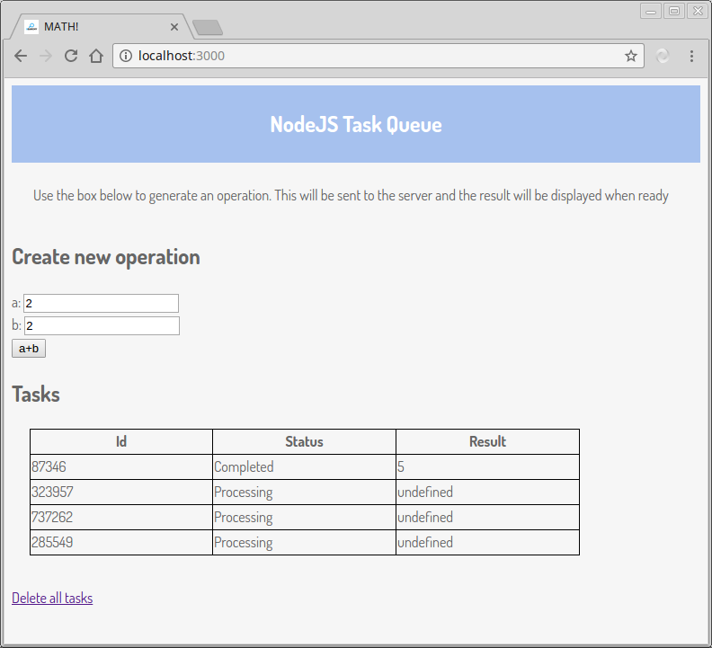

# NodeJS Task Queue

An express server capable of queuing tasks for delayed execution. This is useful for immediately acknowledging an user request (eg. through a 200 HTTP response) and trigger a task that can not be readily completed (eg. a long calculation, file processing, ...), making the actual result available later.

The task queue is implemented using only mongoose, for the sake of simplicity.

To model the problem of deferred processing, a server takes requests to sum two numbers, adds a delay to the operation and makes the result available in other endpoint.

This project is intended for learning from a simple implementation. There are mature tools to solve this problem, such as [Kue](https://github.com/Automattic/kue). Use this experiment at your own risk. Or for learning!  :)

## Running

1. Clone the repository, make sure to have installed nodejs and mongodb on your machine.
2. On the repository folder, run `npm install` to install the recquired packages
3. Run `mongod --dbpath dbfiles/ --smallfiles` to start mongodb.
4. On a new terminal, run `npm start`. The server should start at port 3000.
5. Navigate to http://localhost:3000.



## Implementation

#### Creating an operation

The request to make a sum can be submitted at `POST /math/sum` with a JSON body:

```JSON
{
  "id" : "abc123_some_unique_id",
  "a" : "2",
  "b" : "2"
}
```

id is generated by the client (in our example, javascript running in the browser)

#### Requesting the result

`GET /tasks` fetches an array containing all registered tasks:

```JSON
[{
  "id" : "abc123_some_unique_id",
  "status" : "Completed",
  "result" : "4"
}]
```

The tasks contain the result and the id but not the input data (a and b) this is intentional as in some applications providing access to the input data may not be desirable. When this is needed an endpoint can be provided separately to retrieve this information using the task ID (eg. `GET /math/_id`, not implemented in this demo).

Status can have the values: `Created`, `Processing`, `Failed` and `Completed`.

#### Task Runner

The tasks on the server are all registered on one mongoose collection and their status is used to manage execution.

When a sum is posted, a new Task document is created with status `Pending`. A loop (running asynchronously, started with runner.run()) checks for new pending tasks, registers them as `Processing` and passes the information to the function that will process the task. When the function finishes, the status is altered to eithet `Failed` or `Completed`.

## License and Acknowledgements

This project is made public and free software under the GPL v3 in the hopes it might be interesting or helpful to someone.

The webpage was based on Tania Rascia's cute and awesome [tutorial](https://www.taniarascia.com/how-to-connect-to-an-api-with-javascript/).
